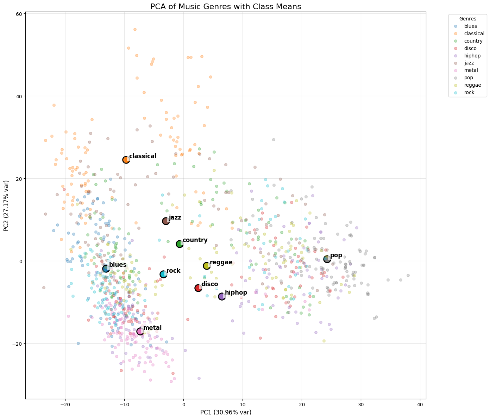

# Music Genre Classification - 學習日記

## 1. 目標 (Objective)
* **分類任務**：使用 Python 實作音樂流派（Genre）自動分類系統。
* **方法驗證**：比較不同距離度量方式（Mahalanobis Distance vs. KL Divergence）對分類精度的影響。
* **數據洞察**：透過 PCA 視覺化檢視不同 Genre 在高維特徵空間中的分布狀態。

## 2. 方法 (Methodology)

### 2.1 MFCC 提取流程 (MFCC Extraction)
MFCC 的核心目標是模擬人類聽覺系統對音色的感知。其提取過程包含以下關鍵步驟：

1. **預加重與分幀 (Pre-emphasis & Windowing)**：將連續訊號切分為短時窗（通常 20-40ms），以確保在該片段內聲音特徵具備平穩性。
2. **快速傅立葉變換 (FFT)**：將聲音從時間域轉為頻率域，提取頻譜能量分布。
3. **梅爾濾波器組 (Mel Filter Bank)**：
   * **模擬聽覺**：根據梅爾刻度 (Mel Scale) 進行頻率壓縮，低頻精細、高頻粗略，符合人耳感官。
   * **統計轉換**：此加總過程觸發了**中央極限定理**，使得輸出特徵更趨向於高斯分佈。
4. **離散餘弦變換 (DCT)**：
   * **去相關性**：將相關的頻譜資訊解耦。這確保了 13 維特徵在統計建模時具備更好的獨立性，支撐了我們使用對角共變異數矩陣的假設。

### 2.2 高斯雲團建模 (Gaussian Modeling)
在獲得 13 維 MFCC 特徵後，我們不再單純處理時間點，而是將一段音樂視為13維特徵空間中的一個雲團：

* **平均值向量 ($\mu$)**：代表該音樂流派在 13 個維度上的「中心音色」位置。
* **共變異數矩陣 ($\Sigma$)**：
   * **幾何意義**：描述了雲團的胖瘦、延伸方向（各維度間的連動性）。
   * **物理意義**：代表了該流派音色的穩定度與動態變化範圍。

### 距離計算數學模型
為了衡量兩段音樂 $P$ 與 $Q$ 的相似度，我們比較了以下兩種數學度量：
```math
D_{KL}(P \parallel Q) = \frac{1}{2} \left[ \underbrace{(\mu_2 - \mu_1)^T \Sigma_2^{-1} (\mu_2 - \mu_1)}_{\text{A. 中心距離 (Mahalanobis)}} + \underbrace{\text{tr}(\Sigma_2^{-1} \Sigma_1) - k}_{\text{B. 形狀差異}} + \underbrace{\ln \left( \frac{\det \Sigma_2}{\det \Sigma_1} \right)}_{\text{C. 體積縮放}} \right]
```
* **Mahalanobis Distance**：僅計算項 A。衡量兩朵雲重心之間的位移，假設兩者分布形狀相同。
* **KL Divergence**：包含 A、B、C 三項。全面捕捉音色的平均值位移、波動規律（旋轉與伸展）以及資訊不確定性的差異。

## 3. 實驗結果 (Results)
透過 KNN 分類器在相同數據集上的表現如下：

| 距離度量方式             | 準確率 (Accuracy) | 說明                                  |
| :----------------------- | :---------------- | :------------------------------------ |
| **Mahalanobis Distance** | **64.22%**        | 僅考慮音色中心位置。                  |
| **KL Divergence**        | **71.88%**        | 考慮音色位置與波動規律，提升約 7.6%。 |

### PCA 視覺化分析

* **類別分離**：如 `Classical` 與 `Metal` 在空間中有明顯的中心位移（項 A 效果顯著）。
* **線性瓶頸**：`Rock`、`Disco`、`Hiphop` 等流派存在嚴重的區域重疊。這解釋了線性統計模型（如單一高斯 KL 散度）在分類邊界上的局限性。


## 4. 結論與後續改進 (Conclusion & Future Work)
1.  **統計特徵的價值**：實驗證明音色的「波動特徵」（共變異數）含有流派辨識的重要資訊，導入完整 KL 散度後準確率有顯著提升。
2.  **模型的邊界**：目前的準確率（~72%）受限於「高斯雲團」抹平了時間序列資訊（例如旋律線與節奏變換）。
3.  **Future Work**：為突破線性特徵的重疊問題，下一階段計畫轉向 **深度學習 (Deep Learning)**。
    * **輸入**：改用梅爾頻譜圖 (Mel-Spectrogram) 影像。
    * **模型**：使用卷積神經網路 (CNN) 提取非線性特徵，解決 PCA 圖中顯示的流派重疊問題。